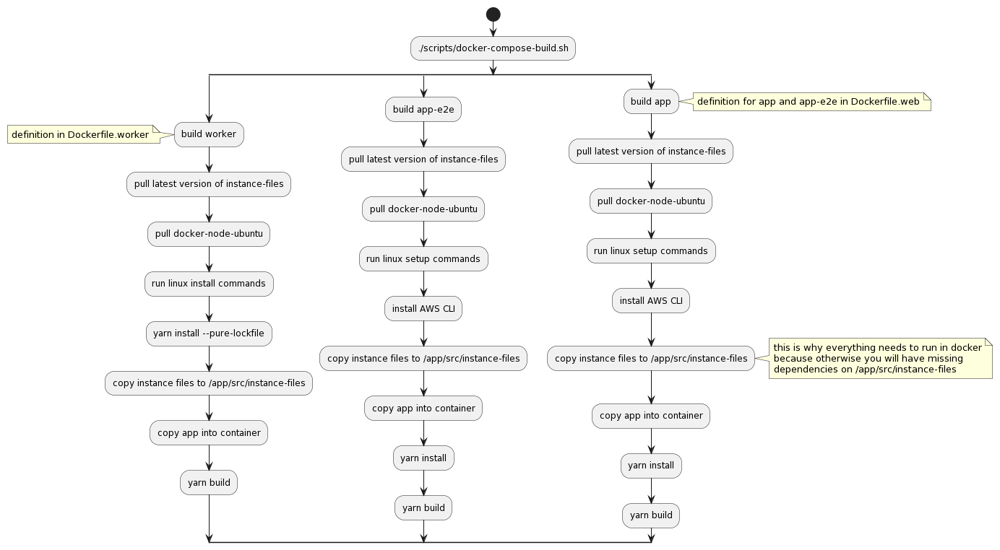
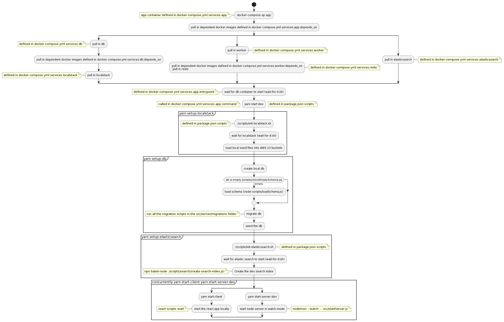

# Complaint Manager

The Complaint Manager is an open source tool meant to aid civilian police oversight agencies in generating complaint data. PDM is designed to be fully integrated into the workflows of these oversight agencies, enabling cities to enhance the capacity of citizens to hold public institutions accountable. [Read more here](https://publicdataworks.github.io/complaint-manager/business-content/introduction-to-police-data-manager.html#introduction-to-police-data-manager).

This README is aimed at getting new users set up to run Complaint Manager on their local machines. You will need the appropriate permissions for the app and its tests to run successfully.

If you are a city looking to adopt Complaint Manager as a tool for Complaint Intake, you can check out the guide to [set up a new city instance](https://publicdataworks.github.io/complaint-manager/technical-content/new-city-setup/new-city-setup-instructions.html).

If you are looking to contribute to this repo, take a look at [our contributor guidelines](https://publicdataworks.github.io/complaint-manager/technical-content/contributing.html).

> [!CAUTION]
> This is a public repository, so please do not include PII (personally identifiable information) for real people in commits to the repository.

## Table of Contents

- [Local Development](#local-development)
  - [Setup](#local-development---setup)
    - [Install Heroku CLI](#install-heroku-cli-optional)
    - [Docker](#docker)
      - [Docker installation](#docker-installation)
      - [Set Docker hosts for Postgres and Redis](#set-docker-hosts-for-postgres-and-redis)
      - [Docker preferences](#docker-preferences)
    - [Set up Git hooks](#set-up-git-hooks)
    - [Install local certificates](#install-local-certificates)
    - [Set up Google Maps API key](#set-up-google-maps-api-key)
      - [Core team](#core-team)
      - [Contributors](#contributors)
    - [Set up test environment variables](#set-up-test-environment-variables)
    - [Set up local environment to point to AWS cloud](#set-up-local-environment-to-point-to-aws-cloud)
    - [Install local dependencies](#install-local-dependencies)
- [Tasks](#local-development---tasks)
  - [Log in to Docker](#log-in-to-docker)
  - [Building the app](#building-the-app)
  - [Running the app locally in watch mode](#running-the-app-locally-in-watch-mode)
  - [Stop and remove all running containers](#stop-and-remove-all-running-containers)
  - [What actually happens when you're running locally?](#what-actually-happens-when-youre-running-locally)
  - [Instance files](#instance-files)
  - [Switching between organizations](#switching-between-organizations)
- [Testing](#local-development---testing)
  - [Running security checks](#running-security-checks)
  - [Running tests](#running-tests)
    - [Running client side tests in watch mode](#running-client-side-tests-in-watch-mode)
    - [Running server side tests in watch mode](#running-server-side-tests-in-watch-mode)
    - [Running worker tests in watch mode](#running-worker-tests-in-watch-mode)
    - [Hints for unit tests](#hints-for-unit-tests)
  - [Running Pact tests locally](#running-pact-tests-locally)
- [Troubleshooting](#local-development---troubleshooting)
  - [Known warnings in the app](#known-warnings-in-the-app)
  - [Known warnings in tests](#known-warnings-in-tests)
- [Miscellaneous](#miscellaneous)
  - [Set Up Prettier](#set-up-prettier)

## Local Development

### Local Development - Setup

[Go to top](#complaint-manager) • [Tasks](#local-development---tasks) • [Testing](#local-development---testing) • [Troubleshooting](#local-development---troubleshooting)

> [!NOTE]
> The default developer platform for our team is MacOS. On other platforms (Linux, Windows) the code should compile and run, but this isn't something that's been tested.

#### Install Heroku CLI (optional)

If you plan to perform administrative tasks on Heroku deployments, manually or by local script, you will need to install [the Heroku CLI](https://devcenter.heroku.com/articles/heroku-cli).

#### Docker

##### Docker installation

For Mac, you can [download Docker here](https://www.docker.com/products/docker).

##### Set Docker hosts for Postgres and Redis

> [!NOTE]
> This is only required if you are running tests outside of the containers OR if you want to run database migrations.

- We depend on access to the local db container for running `server` tests in our IDE and also for running up/down migrations locally
- We depend on access to the local Redis instance for debugging purposes and for running `worker` tests
- Using your text editor of choice, edit `/etc/hosts` file to add the following lines after the first `localhost`:

  ```bash
  127.0.0.1       db
  127.0.0.1       redis
  ```

##### Docker preferences

- To prevent Docker from running out of memory, you will need to adjust your Docker settings
- Under “Resources > Advanced” section in Docker preferences, change your default settings to the following:
  - CPUs: 4
  - Memory: 6.0 GB
  - Swap: 1.0 GB

#### Set up Git hooks

To set up Git hooks, run the following command:

```bash
./scripts/setup-git-hooks.sh
```

The pre-push hook will execute when you run `git push`. It will pull any remote changes, rebuild the app, run all tests, and run the security checks before pushing.

#### Install local certificates

We use a tool called `mkcert` to manage self-signed certificates for the local environment.

- Run these commands to install a signing certificate authority and certificates on your local machine:

    ```bash
    brew install mkcert
    
    # installs the local CA
    mkcert -install
    
    # makes directories to store certs
    cd <root of project>
    mkdir .cert/
    mkdir data/
    
    # generates the local certificates signed by local CA
    mkcert -cert-file .cert/client.crt -key-file .cert/client.key localhost
    
    # local certificiates for exporting audits
    mkcert -cert-file data/server.test.pem.crt -key-file data/server.test.pem.key host.docker.internal
    ```

- Navigate into the data folder and create a file named `server.test.pem`
- Add (or replace if it already exists) the contents in the `server.test.pem` file with the contents of the newly generated `.key` and `.crt` files.

> [!IMPORTANT]
> The `.key` should be at the top and the `.crt` on the bottom.

- If Docker is already set up, run `docker compose down` then `docker compose up app` for changes to take effect.
  - If this is your first time, you can't `docker compose up` yet.

- In `.zshrc` set the `CERT_DIR` environment variable to the directory in which the root cert lives. You can find this directory by running `mkcert -CAROOT`.

  > [!TIP]
  > The directory path will look something like `/Users/<username>/Library/Application\ Support/mkcert`

- If you want to run using certs on Firefox also run `brew install nss`.

##### Troubleshooting

If you run into issues like

```bash
ERROR: failed to read the CA key: open /Users/<username>/Library/Application Support/mkcert/rootCA-key.pem: permission denied
```

You can solve this using:

```bash
sudo chown <username> /Users/<username>/Library/Application\ Support/mkcert/rootCA-key.pem
```

#### Set up Google Maps API key

##### Core team

- Log in to Google with the NOIPM infrastructure Google account from 1Password.
- Look up the Core Team API key for test environment at https://console.cloud.google.com/apis/credentials.
- Set a local environment variable called `REACT_APP_GOOGLE_API_KEY` with this test key in your `~/.profile` or `~/.zshrc` file.

##### Contributors

- You will receive a Contributor Test Key for Google Maps API from a Core Team member.
- Set a local environment variable called `REACT_APP_GOOGLE_API_KEY` with this test key in your `~/.profile` or `~/.zshrc` file.

#### Set up test environment variables

- Using your credentials for Auth0 CI, set local test environment variables called `TEST_USER` and `TEST_PASS` in either your `~/.profile` or `~/.zshrc` file.

> [!NOTE]
> Make sure your credentials are given DPM access.

> [!TIP]
> Contributors should receive these credentials from a Core Team member.

#### Set up local environment to point to AWS cloud

You only need this if you want to bypass LocalStack and test things using real AWS services like S3 and SecretsManager.

- You must change `USE_CLOUD_SERVICES` and `REACT_APP_USE_CLOUD_SERVICES` from `false` to `true` in `docker-compose.yml`.
- You will need to set up `AWS_ACCESS_KEY_ID` and `AWS_SECRET_ACCESS_KEY` in your environment variables so PDM can connect to AWS.

#### Install local dependencies

To install dependencies on your machine (as opposed to in the Docker container), run:

```bash
yarn install
```

- You will need these for running unit tests outside the of a container.
- Also, security checks will run against your locally installed dependencies.

### Local Development - Tasks

[Go to top](#complaint-manager) • [Setup](#local-development---setup) • [Testing](#local-development---testing) • [Troubleshooting](#local-development---troubleshooting)

#### Log in to Docker

Log in to Docker using credentials provided by the Core Team with the following command:

```bash
docker login
```

#### Building the app

Run the following command:

```bash
./scripts/docker-compose-build.sh
```

- You should not need to rebuild very often. When a new package is added, you will need to rebuild.

#### Running the app locally in watch mode

Run the following command:

```bash
docker compose up app
```

Wait for both the back and front end to initialize.

- Healthy console outputs for back end:
  
```bash
Application is listening on port 1234
Please visit http://localhost:1234
```
  
- Healthy console outputs for front end:
  
```bash
Compiled with warnings.
```
  
Navigate to `https://localhost` to view the app.

#### Stop and remove all running containers

Run the following command:

```bash
docker compose down
```

#### What actually happens when you're running locally?

It's all well and good to run these commands and watch Docker spin up with a lot of command line outputs, but what's actually happening?

##### ./scripts/docker-compose-build.sh

`docker-compose-build.sh` builds the Docker containers `worker`, `app-e2e`, and `app` so that they can then be spun up to run locally. The diagram below shows the steps and indicates where those steps are configured:



[PlantUML link](http://www.plantuml.com/plantuml/proxy?cache=no&src=https://raw.githubusercontent.com/PublicDataWorks/complaint-manager/master/docs/technical-content/plantuml/docker-compose-build.puml)

##### docker-compose up app

`docker-compose up app` runs the app container (which includes the client and server and pulls in the database, worker, and elasticsearch) so that you can use it locally. The diagram below shows the steps it takes and indicates where those steps are configured:



[PlantUML link](http://www.plantuml.com/plantuml/proxy?cache=no&src=https://raw.githubusercontent.com/PublicDataWorks/complaint-manager/master/docs/technical-content/plantuml/docker-compose-up.puml)

#### Instance files

By default, local builds will pull `publicdataworks/instance-files-noipm:latest`.

To create a new versioned `instance-files-noipm` image (_e.g._ `publicdataworks/instance-files-noipm:1.0.0`), execute the following commands from your private instance files repository (`instance_files_noipm`):

```bash
docker login $DOCKER_USERNAME $DOCKER_PASSWORD
docker build -t publicdataworks/instance-files-noipm:your-tag .
docker push publicdataworks/instance-files-noipm:your-tag
```

#### Switching between organizations

<!-- TODO: Add this section -->

### Local Development - Testing

[Go to top](#complaint-manager) • [Setup](#local-development---setup) • [Tasks](#local-development---tasks) • [Troubleshooting](#local-development---troubleshooting)

> [!IMPORTANT]
> The following must be performed before pushing any code.

#### Running security checks

Run the following command:

```bash
docker compose run --rm security-checks
```

#### Running tests

##### Running client side tests in watch mode

To run all tests in `src/client` in parallel, run the following command: 

```bash
yarn test:client
```

> [!NOTE]
> Like other tests, client tests can be run in Docker. However, since they don't require the test database, they can be run outside of Docker, which is faster.

##### Running server side tests in watch mode

Set up a test database and run all tests in `src/server` sequentially with the following command:

```bash
docker-compose run --rm app yarn test:server
```

##### Running worker tests in watch mode

Set up a test DB and run all tests in `src/worker` sequentially with the following command:

```bash
docker-compose run --rm app yarn test:worker
```

##### Hints for unit tests

Tips for when you want to run a specific test suite in the terminal for either client, server, or worker tests:

- Run the command for either client, worker, or server tests depending on the type of test you are working on
- Once the database is prepared and the tests begin to run, press the `Enter` key and then the `P` key
- Then start typing the file name where the desired test suite lives and once selected, press `Enter`
- The test suite will rerun every time you make a change to the test file and any corresponding files

#### Running Pact tests locally

> [!IMPORTANT]
> Client Pact tests must come before server Pact tests.

Run client Pact tests with the following command:

```bash
yarn test:pact:client
```

Run server Pact tests with the following command: 

```bash
docker compose run --rm app yarn test:pact:server
```

> [!TIP]
> For more information on Pact, visit http://pact.io.

### Local Development - Troubleshooting

[Go to top](#complaint-manager) • [Setup](#local-development---setup) • [Tasks](#local-development---tasks) • [Testing](#local-development---testing)

#### Known warnings in the app

- We currently see the following warnings from `pdfjs`. This is a known issue where `pdfjs` is not compatible with webpack 4.2.

  ```
  Critical dependency: require function is used in a way in which dependencies cannot be statically extracted
  ```

  - We use a workaround that copies the `pdf.worker.js` file to our build directory in a postbuild script.
  - Hopefully this will be fixed in a future release of `pdfjs`.
  - More info here: https://github.com/wojtekmaj/react-pdf/wiki/Known-issues

- There is a warning about duplicate props on the `PhoneNumberField`. These are actually two different props that have the same name, but different capitalization: `inputProps` and `InputProps`. They are needed.

#### Known warnings in tests

- You may see the following warning when running tests:

  ```bash
  Cannot find module 'pg-native' from 'client.js'

        However, Jest was able to find:
          './client.js'

        You might want to include a file extension in your import, or update your 'moduleFileExtensions', which is currently ['web.js', 'js', 'web.ts', 'ts', 'web.tsx', 'tsx', 'json', 'web.jsx', 'jsx', 'node'].

        See https://jestjs.io/docs/en/configuration#modulefileextensions-array-string
  ```

- You can safely ignore this warning. The tests will still pass.

## Miscellaneous

### Set Up Prettier

This project has a `prettierrc.js` file that dictates formatting. To set this up to work automatically in VSCode first add the prettier extension, then go to Code > Preferences > Settings and turn on the setting "Format on Save" (you can do Format on Paste too if you want) and set the "Default Formatter" to prettier.

[Go to top](#complaint-manager)
