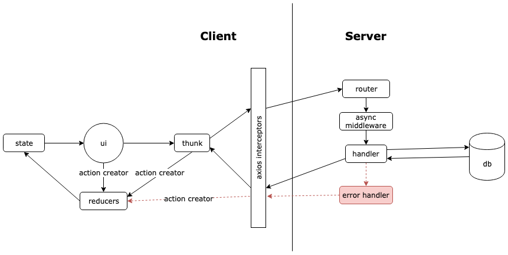

# Development Resources

## Architecture Diagram


Frontend:

- [React](https://reactjs.org/) - A JavaScript library used to build UI components. We use a combination of functional and class
  components within our application. Some functional components utilize React [hooks](https://reactjs.org/docs/hooks-overview.html) like useEffect and useState.
- [Redux](https://redux.js.org/) - A JavaScript library used to manage application state. We also use [redux-forms](https://redux-form.com/8.3.0/docs/api/) throughout our application.
- [Material UI](https://material-ui.com/) - A React component library that we utilize for easing UI design.
- [Plotly](https://plotly.com/javascript/) - A JavaScript graphing library that we use for data visualizations.
- [Auth0](https://auth0.com/) - **DISABLED BY DEFAULT** - SaaS which allows for integrating authentication and authorization into our application.
  We use JWT authentication, as well as assign roles and permissions to users in higher environments. Additonally, we have an [SPA + API](https://auth0.com/docs/architecture-scenarios/spa-api)
  architecture.

Backend:

- [Node](https://nodejs.org/en/) / [Express](https://expressjs.com/) - We use Express as our server framework.
- [PostgreSQL](https://www.postgresql.org/) - An object-relational database that we use for data storage.
- [Sequelize](https://sequelize.org/v5/) - A promise-based JavaScript library which serves as our object-relational mapper.
- [Redis](https://redis.io/) - A data structure store where jobs await execution by BG workers.
- [Bull](https://optimalbits.github.io/bull/) - A queue used to store queued jobs in Redis.
- [Elasticsearch](https://www.elastic.co/elasticsearch/) - A search engine used to index data stored in our database. Currently, we support searches on Tag Names, Accused, and Complainant Names.

Infrastructure:

- [Docker](https://www.docker.com/) - PaaS which enables us to execute our code in containers. We utilize multiple docker images including ubuntu, elasticsearch, and localstack.
- [Terraform](https://www.terraform.io/) - IaC which enables us to manage varying services and resources within our application.
- [AWS API Gateway](https://aws.amazon.com/api-gateway/#:~:text=Amazon%20API%20Gateway%20is%20a,secure%20APIs%20at%20any%20scale.&text=Using%20API%20Gateway%2C%20you%20can,time%20two%2Dway%20communication%20applications.) - **DISABLED BY DEFAULT** -
  Higher environments send requests from client browser through an API Gateway running on an HTTP/2 protocol.

Document Storage

- [LocalStack](https://localstack.cloud/) - An AWS mocking framework used when AWS services are disabled in development.
- [AWS S3](https://aws.amazon.com/s3/) - **DISABLED BY DEFAULT** - Used for document storage of case attachments and letters.

Logging and Monitoring

- [Papertrail](https://www.papertrail.com/) - Used for log storage and error alerting.
- [New Relic](https://newrelic.com/) - Used to monitor performance.
- [Google Analytics](https://analytics.google.com/analytics/web/provision/#/provision) - Used for web application analytics.

Continuous Integration and Deployment

- [Heroku](https://www.heroku.com/) - PaaS that hosts our application.
- [CircleCI](https://circleci.com/)

Additionally, feel free to take a look at some of our Architectural Decisions [here](https://github.com/PublicDataWorks/complaint-manager/tree/master/doc/adr).

## React-Redux Data Flow Diagram



## API Documentation

### Postman

[Postman](https://www.postman.com/postman/) is a REST client, API runner, and documentation tool. We use it
to test out our API endpoints without the overhead of the frontend. You can explore some of the documented endpoints [here](https://documenter.getpostman.com/view/9553211/TWDUqdn1).

Setting collection up locally:

- If you want to explore the endpoints locally, you must [download Postman](https://www.google.com/url?q=https%3A%2F%2Fwww.postman.com%2Fdownloads%2F&sa=D&sntz=1&usg=AFQjCNGNCmoiHMIEgBbM7x_gB1sxfChi3g) first.
  Once it's installed, you will need to import the collection as well as the local environment. The files used are located in the `<project root>/doc/postman` directory.
  If you already have Postman installed, you can simply click the following:
  [](https://app.getpostman.com/run-collection/ec8033f0f806e39f166c)

At the time of writing, they include:

- Police Data Management.\*.json
- Local.\*.json
- CI.\*.json
- Staging.\*.json

## Development Patterns

**Soft Delete**

We use the `paranoid` flag in Sequelize to ‘soft delete’ records instead of removing them from the database. This is important to know when
you run any raw queries that you need to select rows where `deleted_at` is null, or you’ll pull in data that is supposed to be deleted. This
comes into play in our export case information functionality.

**Wrapping Migrations in a Single Transaction**

When we write migrations, we wrap the changes in "transactions" which are essentially promises that Sequelize creates to touch the database.
To ensure that we don't have changes left hanging when a migration fails, we want to wrap the entire migration in a single transaction.
There may be many smaller transactions within the single wrapper transaction, but they would all roll back if one fails.

To do so, pass `transaction` as a param in referenced `async` functions. Take a look at [transformDuplicateCaseNoteActions.js](https://github.com/PublicDataWorks/complaint-manager/blob/master/src/server/migrationJobs/transformDuplicateCaseNoteActions.js)
and [20200108192000-remove-duplicates-case-note-actions.js](https://github.com/PublicDataWorks/complaint-manager/blob/master/src/server/migrations/20200108192000-remove-duplicates-case-note-actions.js) for reference.

## Testing

**Unit Tests**

A unit test is meant to verify that a piece of code (i.e. method, component, process) is functioning as expected. Unit tests are meant to test
these units independent of dependencies, so we utilize mocking frameworks like [Jest](https://jestjs.io/docs/en/getting-started) and [Nock](https://github.com/nock)

- We split our unit test suites into the following categories:

  - Client - unit tests for client using Jest, [Enzyme](https://enzymejs.github.io/enzyme/), and [React-Testing](https://testing-library.com/docs/react-testing-library/intro/) library
  - Server & Worker - unit tests for server using Jest, request tests with [SuperTest](https://www.google.com/url?q=https%3A%2F%2Fgithub.com%2Fvisionmedia%2Fsupertest&sa=D&sntz=1&usg=AFQjCNGUe1lAcWNPyBtnhD4TSFhiVjK3RA),
    handler tests with Nock

  Some of these tests utilize Builders defined within [`src/sharedTestHelpers/`](https://github.com/PublicDataWorks/complaint-manager/tree/master/src/sharedTestHelpers) which are helper functions
  to build out dummy data for our tests.

  Additionally, for some of these unit tests, we use [Jest snapshots](https://jestjs.io/docs/en/snapshot-testing) to verify that components or documents render as we expect.

**E2E Tests**

End-to-end tests are meant to test the application from the end user's perspective by simulating a real user session.

- We use [NightWatch](https://nightwatchjs.org/guide/using-nightwatch/writing-tests.html) to write our automated E2E tests.
  - Sessions are configured to run on Chrome browser using [chromedriver](https://chromedriver.chromium.org/).

**Integration Tests**

An integration test verifies that all modules within a codebase work together as expected.

- Our integration test suite is defined as a [Collection Runner](https://learning.postman.com/docs/running-collections/intro-to-collection-runs/)
  in Postman (see [API Documentation](https://publicdataworks.github.io/complaint-manager/technical-context/development-resources.html#api-documentation)).

**Health Check**

We have a basic health check endpoint to ensure that our server is working and available.

**Conditionally Run Tests**

You might notice that some test suites have the message "Skipping test, Auth is disabled.", this is because we have added flags to our application which
disable Cloud Services. The benefit of this is that you do not have to have an AWS or Auth0 account to begin using the Complaint Manager app (simply run a `docker-compose up app`!).
However, if you want to, for whatever reason, use authentication or AWS locally, then follow these simple instructions
(You will need a login under a tenant of Auth0 and an AWS account to use the app locally):

- **Note**: You cannot have a situation in which authentication is on and AWS is off or vice versa. Both authentication and AWS have to be on or both authentication and AWS have to be off.

1. Locate [docker-compose.yml](https://github.com/PublicDataWorks/complaint-manager/blob/master/docker-compose.yml). In this file, you should see:

   ```
   services:
       app:
       ...
       environment:
       ...
       - USE_CLOUD_SERVICES=false
       - REACT_APP_USE_CLOUD_SERVICES=false
   ```

2. Now, you must change `USE_CLOUD_SERVICES` and `REACT_APP_USE_CLOUD_SERVICES` from false to true.

3. Additionally, with these services enabled, the application will now expect you to have the following local environment variables:

   - `TEST_USER`
   - `TEST_PASS`
   - `AWS_ACCESS_KEY_ID` (this account should have access to services PDM requires like S3 and SecretsManager)
   - `AWS_SECRET_ACCESS_KEY` (this account should have access to services PDM requires like S3 and SecretsManager)

4. Repeat steps 1 and 2 but now for the `worker` and `app-e2e` services (within the same file, below the app service).
   - For E2E tests, you must also change variable `disableAuthentication` in the `nightwatch.conf.js` file in your `instance-files` repository from true to false.
   - **Note**: These changes will now invoke authentication when running `yarn e2e` locally.
5. Run up localhost in your terminal like you normally would (`docker-compose up app`) and the app should now need AWS and authentication credentials and you can move about the app freely.

For instructions on how to execute the tests discussed here, see [README](https://github.com/PublicDataWorks/complaint-manager/blob/master/README.md)

## Security

- We regularly scan for outdated dependencies with [Hawkeye](https://github.com/hawkeyesec/scanner-cli)
  Scanner, which runs on all commits. When a vulnerability is identified, we use [Snyk Vulnerability Database](https://snyk.io/vuln)
  for information and remediation. Hawkeye is also useful for ensuring that no secrets or passwords are
  checked into our application code.
- We subscribe to security advisories for different technologies within our tech stack, so we
  can receive prompt notification of any incidents or outages (i.e, Docker, AWS, Heroku, etc.).
- We implement a strict Content Security Policy (CSP) for all our environments using [Helmet](https://www.npmjs.com/package/helmet),
  which we evaluate using Google's [CSP Evaluator](https://csp-evaluator.withgoogle.com/) tool.
- We use SSL for encryption of request/response. [SSL certificates are automatically
  managed and renewed by Heroku](https://devcenter.heroku.com/articles/understanding-ssl-on-heroku).
- Our Postgres database is encrypted at rest (provided by hosting on Heroku).
- [**Only applicable if enabled**] AWS S3 files are encrypted with AES-256 Server-Side Encryption using Amazon S3-Managed Keys (SSE-S3) at rest and in transit.
